# dcode-app-factory

LangGraph + deepagents implementation of the AI software product factory defined in `SPEC.md`, including:

- Product Loop with structured `ProductSpec` validation and emission
- Unified request intake for full app specs and incremental feature/bugfix/refactor/task requests
- Project Loop `StateGraph` dispatch cycle (`init_state_machine -> dispatch -> engineering -> update_state_machine`)
- Engineering Loop `StateGraph` with level-aware `micro_plan` (L2 system, L3 service, L4 component, selective L5 class contracts) + per-module iteration and nested debate subgraph
- Debate subgraph routing (`propose -> challenge -> route -> revise/adjudicate -> ship/halt`) using `Command(goto=...)` and parent propagation support
- Release Loop integration gates (`dependency`, `fingerprint`, `deprecation`, `code_index`, `contract_completeness`, `compatibility`, `ownership`, `context_pack_compliance`)
- Filesystem state-store with universal artifact envelopes, levelled contract persistence, context-pack persistence, exceptions, escalations, debates, modules, and release manifests
- Chroma-backed append-only Code Index with OpenAI semantic embeddings by default, metadata filters, lifecycle transitions, and model-change reindex support
- Backend enforcement wrappers for immutability, opaque implementation access control, and level-aware context-pack permissions
- SQLite checkpointing for outer/project graph execution

## System Overview

```
 RAW WORK REQUEST (SPEC.md, --request-file, or --request-text)
         |
         v
 +===================================================+
 |           FACTORY ORCHESTRATOR (outer graph)       |
 |                                                    |
 |  +----------------------------------------------+ |
 |  | 1. PRODUCT LOOP                              | |
 |  |    raw work request                          | |
 |  |      -> parse into ProductSpec hierarchy     | |
 |  |         (Pillars > Epics > Stories > Tasks)  | |
 |  |      -> assign canonical task IDs            | |
 |  |      -> validate DAG + I/O contract sketches | |
 |  |      -> deep-agent quality review            | |
 |  +----------------------------------------------+ |
 |         |                                          |
 |         v                                          |
 |  +----------------------------------------------+ |
 |  | APPROVAL GATE  (human-in-the-loop)           | |
 |  |    APPROVE --> proceed                       | |
 |  |    REJECT  --> restart product loop           | |
 |  |    AMEND   --> restart with feedback (max 3)  | |
 |  +----------------------------------------------+ |
 |         |                                          |
 |         v                                          |
 |  +----------------------------------------------+ |
 |  | 2. PROJECT LOOP  (dispatch cycle)            | |
 |  |                                              | |
 |  |    init state machine (task DAG)             | |
 |  |         |                                    | |
 |  |         v                                    | |
 |  |    +-> dispatch -----> no tasks? ---> done   | |
 |  |    |   (pick PENDING task w/ deps met)       | |
 |  |    |        |                                | |
 |  |    |        v                                | |
 |  |    |   +---------------------------------+   | |
 |  |    |   | 3. ENGINEERING LOOP (per task)  |   | |
 |  |    |   |                                 |   | |
 |  |    |   |   micro_plan                    |   | |
 |  |    |   |     decompose task -> modules   |   | |
 |  |    |   |     reuse analysis (code index) |   | |
 |  |    |   |        |                        |   | |
 |  |    |   |        v                        |   | |
 |  |    |   |   for each module (topo order): |   | |
 |  |    |   |     build contract + context    |   | |
 |  |    |   |        |                        |   | |
 |  |    |   |        v                        |   | |
 |  |    |   |   +---------------------------+ |   | |
 |  |    |   |   | 4. DEBATE SUBGRAPH        | |   | |
 |  |    |   |   |                           | |   | |
 |  |    |   |   |  propose (claim + checks) | |   | |
 |  |    |   |   |       |                   | |   | |
 |  |    |   |   |       v                   | |   | |
 |  |    |   |   |  challenge (R1-R6 rubric) | |   | |
 |  |    |   |   |       |                   | |   | |
 |  |    |   |   |       v                   | |   | |
 |  |    |   |   |  PASS? --yes--> adjudicate| |   | |
 |  |    |   |   |    |              |       | |   | |
 |  |    |   |   |    no + retries   v       | |   | |
 |  |    |   |   |    |          APPROVE?    | |   | |
 |  |    |   |   |    v          /     \     | |   | |
 |  |    |   |   |  revise     ship    halt  | |   | |
 |  |    |   |   |  (loop)      |       |    | |   | |
 |  |    |   |   +-----|--------|-------|----+ |   | |
 |  |    |   |         |        |       |      |   | |
 |  |    |   |         |        v       v      |   | |
 |  |    |   |         |    seal +   escalate  |   | |
 |  |    |   |         |    register   + block |   | |
 |  |    |   |         |    in index   deps    |   | |
 |  |    |   +---------|---------|---------+   | |
 |  |    |             |         |             | |
 |  |    |   update state machine              | |
 |  |    |   (SHIPPED / HALTED / BLOCKED)      | |
 |  |    +-------<---loop back---<-------------+ |
 |  +----------------------------------------------+ |
 |         |                                          |
 |         v                                          |
 |  +----------------------------------------------+ |
 |  | 5. RELEASE LOOP                              | |
 |  |    collect shipped modules                   | |
 |  |    expand transitive dependency closure      | |
|  |    run 8 gates:                              | |
 |  |      - dependency completeness               | |
 |  |      - fingerprint verification              | |
 |  |      - deprecation check                     | |
|  |      - code index status check               | |
|  |      - contract completeness                 | |
|  |      - compatibility                         | |
|  |      - ownership                             | |
|  |      - context-pack compliance               | |
 |  |    emit release manifest (PASS / FAIL)       | |
 |  +----------------------------------------------+ |
 +===================================================+
         |
         v
 OUTPUT: project_success · release_result · release_details

 +--------------------------+   +-----------------------+
 | STATE STORE (filesystem) |   | CODE INDEX (ChromaDB) |
 |  product/  spec.json/md  |   |  append-only semantic |
 |  project/  state_machine |   |  search for reuse     |
 |  tasks/    per-task .md  |   |  CURRENT -> DEPRECATED|
 |  artifacts/ envelopes    |   |  auto-reindex on      |
|  modules/  sealed+immut  |   |  embedding model swap |
|  system_contracts/       |
|  service_contracts/      |
|  class_contracts/        |
 |  debates/  prop/chal/adj |   +-----------------------+
 |  context_packs/          |
 |  escalations/            |   +-----------------------+
 |  release/  manifests     |   | ENFORCEMENT BACKENDS  |
 |  checkpoints/ sqlite     |   |  OpaqueEnforcement    |
 +--------------------------+   |  ImmutableArtifact    |
                                |  ContextPack RBAC     |
                                +-----------------------+

 KEY CONCEPTS
 ============
 ProductSpec     Pillars > Epics > Stories > Tasks (hierarchical spec)
 MicroPlan       Task decomposed into level-aware modules with topo ordering
 Boundary Levels L1 functional -> L2 system -> L3 service -> L4 component -> selective L5 class
 Contract        Formal I/O interface per module (SHA-256 fingerprinted)
 ClassContract   Shared/orchestrating class boundary consumed as black box
 Debate          Adversarial propose/challenge/adjudicate quality gate
 ArtifactEnvelope Universal wrapper: DRAFT -> SHIPPED -> DEPRECATED
 ContextPack     Per-role access control (FULL / CONTRACT_ONLY / etc.)
 Reuse-First     Search code index before creating anything new
 Sealed Module   Shipped impl dirs are locked (.sealed + .immutable)
 Escalation      Created on engineering failure; triggers human review
```

### Mermaid Diagram

```mermaid
flowchart TB
    subgraph ENTRY["Entry Point"]
        RAW_SPEC["Raw Work Request<br/>(SPEC.md, --request-file, or --request-text)"]
        CLI["factory_main.py<br/>--request-file · --request-kind · --target-codebase-root · --approval-action · --log-level"]
    end

    RAW_SPEC --> CLI
    CLI --> ORCH

    subgraph ORCH["FactoryOrchestrator — Outer LangGraph StateGraph"]
        direction TB

        subgraph PL["① Product Loop"]
            direction TB
            PL_PARSE["parse_raw_request_to_product_spec()<br/>Request → ProductSpec"]
            PL_IDS["apply_canonical_task_ids()<br/>T-pillar-epic-story-seq"]
            PL_VAL["validate_spec()<br/>schema · DAG · I/O sketches · criteria"]
            PL_EMIT["render_spec_markdown()<br/>emit_structured_spec()"]
            PL_AGENT["deepagents.create_deep_agent<br/>(researcher · structurer · validator)"]
            PL_PARSE --> PL_IDS --> PL_VAL --> PL_EMIT --> PL_AGENT
        end

        PL_AGENT --> GATE

        subgraph GATE["Approval Gate"]
            direction LR
            GATE_INT["interrupt() — Human-in-the-Loop"]
            GATE_DEC{{"APPROVE / REJECT / AMEND"}}
            GATE_INT --> GATE_DEC
        end

        GATE_DEC -- "REJECT or AMEND<br/>(feedback appended)" --> PL
        GATE_DEC -- "APPROVE" --> PROJ

        subgraph PROJ["② Project Loop — Nested LangGraph StateGraph"]
            direction TB
            PROJ_INIT["init_state_machine<br/>build ProjectState from spec<br/>write task markdown files"]
            PROJ_DISP["dispatch<br/>find PENDING tasks with all deps SHIPPED<br/>transition → IN_PROGRESS"]
            PROJ_ENG_WRAP["engineering<br/>(runs EngineeringLoop for task)"]
            PROJ_UPD["update_state_machine<br/>SHIPPED / HALTED / BLOCKED"]

            PROJ_INIT --> PROJ_DISP
            PROJ_DISP -- "eligible task found" --> PROJ_ENG_WRAP
            PROJ_ENG_WRAP --> PROJ_UPD
            PROJ_UPD -- "more tasks" --> PROJ_DISP
        end

        PROJ_DISP -- "no eligible tasks" --> PROJ_END["Project Done"]

        subgraph ENG["③ Engineering Loop — Nested LangGraph StateGraph"]
            direction TB
            MP["micro_plan<br/>decompose Task → MicroPlanModules<br/>classify: ingress · core · integration · egress · verification"]
            REUSE_A["Reuse Analysis<br/>search_code_index()<br/>similarity + token overlap check"]
            MP --> REUSE_A
            REUSE_A --> MS

            subgraph MS["module_step (iterates per module in topo order)"]
                direction TB
                MS_REUSE{"Reuse<br/>candidate?"}
                MS_CTX["Build ContextPacks<br/>(proposer · challenger · arbiter)"]
                MS_CONTRACT["Build MicroModuleContract<br/>I/O · errors · effects · modes<br/>interface_fingerprint (SHA-256)"]
                MS_ART["Create ArtifactEnvelope<br/>DRAFT → CHALLENGED → ADJUDICATED"]

                MS_REUSE -- "Yes: skip, mark SHIPPED" --> MS_DONE["Module Done"]
                MS_REUSE -- "No: create new" --> MS_CTX --> MS_CONTRACT --> MS_ART
            end

            MS_ART --> DEBATE

            subgraph DEBATE["④ Debate Subgraph — Nested LangGraph StateGraph"]
                direction TB
                D_PROP["propose<br/>generate Proposal<br/>(claim · deliverable_ref · acceptance_checks)"]
                D_CHAL["challenge<br/>evaluate R1–R6 rubric<br/>(completeness · testability · budget<br/>dependency · security · compatibility)"]
                D_ROUTE{"route<br/>FAIL + retries?"}
                D_REV["revise<br/>refine proposal"]
                D_ADJ["adjudicate<br/>Arbiter decision:<br/>APPROVE · APPROVE_WITH_AMENDMENTS · REJECT"]
                D_POST{"post_adjudicate"}
                D_SHIP["ship<br/>persist debate · mark shipped"]
                D_HALT["halt<br/>persist debate · mark halted<br/>propagate to parent"]

                D_PROP --> D_CHAL --> D_ROUTE
                D_ROUTE -- "FAIL + retries left" --> D_REV --> D_PROP
                D_ROUTE -- "PASS or no retries" --> D_ADJ --> D_POST
                D_POST -- "APPROVE / APPROVE_WITH_AMENDMENTS" --> D_SHIP
                D_POST -- "REJECT + retries" --> D_REV
                D_POST -- "REJECT + no retries" --> D_HALT
            end

            D_SHIP --> SHIP_ACTS
            D_HALT --> FAIL_ACTS

            subgraph SHIP_ACTS["Ship Actions"]
                direction LR
                SA_EVID["Write ShipEvidence"]
                SA_SEAL["seal_module()<br/>.sealed + .immutable markers"]
                SA_IDX["Register in CodeIndex"]
                SA_STAT["Artifact → SHIPPED"]
                SA_EVID --> SA_SEAL --> SA_IDX --> SA_STAT
            end

            subgraph FAIL_ACTS["Failure Actions"]
                direction LR
                FA_MARK["Mark module FAILED"]
                FA_CASCADE["Cascade-abandon<br/>dependent modules"]
                FA_MARK --> FA_CASCADE
            end

            MS_ROUTE{"module_route<br/>more modules?"}
            SHIP_ACTS --> MS_ROUTE
            FAIL_ACTS --> MS_ROUTE
            MS_DONE --> MS_ROUTE
            MS_ROUTE -- "next module" --> MS
            MS_ROUTE -- "all done" --> FINALIZE

            FINALIZE["finalize<br/>if failures → create EscalationArtifact"]
        end

        PROJ_ENG_WRAP -.-> ENG

        PROJ_UPD -- "HALTED → escalation" --> HUMAN_RES

        subgraph HUMAN_RES["Human Resolution (interrupt)"]
            direction LR
            HR_ACTIONS["APPROVE_OVERRIDE · AMEND_SPEC<br/>SPLIT_TASK · REVISE_PLAN<br/>PROVIDE_FIX · ABANDON_TASK"]
        end

        PROJ_END --> REL

        subgraph REL["⑤ Release Loop — LangGraph StateGraph"]
            direction TB
            REL_INIT["init<br/>collect all shipped module_refs<br/>expand transitive dependency closure"]

            subgraph GATES["gate_check — 8 Release Gates"]
                direction TB
                G1["dependency_check<br/>all deps present in release set"]
                G2["fingerprint_check<br/>interface fingerprints verifiable"]
                G3["deprecation_check<br/>no DEPRECATED or SUPERSEDED modules"]
                G4["code_index_check<br/>all modules CURRENT"]
                G5["contract_completeness_check<br/>L2/L3/L4/L5 contract artifacts present"]
                G6["compatibility_check<br/>no BREAKING_MAJOR entries in release set"]
                G7["ownership_check<br/>all modules have owners"]
                G8["context_pack_compliance_check<br/>contract-only permissions are level-scoped"]
            end

            REL_FIN["finalize<br/>write release manifest JSON<br/>PASS / FAIL"]

            REL_INIT --> GATES --> REL_FIN
        end
    end

    subgraph INFRA["Supporting Infrastructure"]
        direction TB

        subgraph SS["State Store (Filesystem)"]
            direction LR
            SS_PROD["product/<br/>spec.json · spec.md"]
            SS_PROJ["project/<br/>state_machine.json"]
            SS_TASK["tasks/<br/>{task_id}.md"]
            SS_ART["artifacts/<br/>envelope.json · payload"]
            SS_SYS["system_contracts/<br/>contract.json"]
            SS_SVC["service_contracts/<br/>contract.json"]
            SS_MOD["modules/<br/>contract · examples · ship<br/>.sealed · .immutable"]
            SS_CLS["class_contracts/<br/>contract.json"]
            SS_DEB["debates/<br/>proposal · challenge · adjudication"]
            SS_CP["context_packs/<br/>{cp_id}.json"]
            SS_ESC["escalations/<br/>{esc_id}.json"]
            SS_REL["release/<br/>{release_id}.json"]
        end

        subgraph CI["Code Index (ChromaDB)"]
            direction LR
            CI_ADD["add_entry() — append-only"]
            CI_SEARCH["search() — semantic query"]
            CI_STATUS["set_status()<br/>CURRENT → DEPRECATED · SUPERSEDED"]
            CI_REINDEX["reindex() — embedding model change"]
        end

        subgraph BACKENDS["Enforcement Backends"]
            direction LR
            BE_FS["FilesystemBackend"]
            BE_OPAQUE["OpaqueEnforcementBackend<br/>blocks reads of sealed impl"]
            BE_IMMUT["ImmutableArtifactBackend<br/>blocks writes to shipped artifacts"]
            BE_CTXP["ContextPackBackend<br/>role-based access control"]
            BE_FS --> BE_OPAQUE --> BE_IMMUT --> BE_CTXP
        end

        subgraph LLM_LAYER["LLM Abstraction"]
            direction LR
            LLM_CHAT["ChatOpenAI<br/>(frontier · efficient · economy)"]
            LLM_STRUCT["StructuredOutputAdapter<br/>function_calling + strict=true"]
            LLM_EMBED["Embeddings<br/>text-embedding-3-large"]
            LLM_MODEL["RuntimeModelSelection<br/>tier routing"]
        end

        CKPT["SQLite Checkpointing<br/>langgraph.sqlite"]
    end

    PL_EMIT -.-> SS_PROD
    PROJ_INIT -.-> SS_PROJ
    PROJ_INIT -.-> SS_TASK
    MS_ART -.-> SS_ART
    D_SHIP -.-> SS_DEB
    D_HALT -.-> SS_DEB
    SA_SEAL -.-> SS_MOD
    SA_IDX -.-> CI_ADD
    REUSE_A -.-> CI_SEARCH
    FINALIZE -.-> SS_ESC
    REL_FIN -.-> SS_REL
    MS_CTX -.-> SS_CP
    DEBATE -.-> LLM_STRUCT
    PL_AGENT -.-> LLM_CHAT
    ORCH -.-> CKPT

    subgraph OUTPUT["Final Output"]
        OUT_SUCCESS["project_success = True / False"]
        OUT_RELEASE["release_result = PASS / FAIL"]
        OUT_DETAILS["release_details JSON"]
    end

    REL_FIN --> OUTPUT
```



## Requirements

1. Python 3.12+
2. `uv`
3. `OPENAI_API_KEY` set in the environment

## Setup

```bash
uv sync --all-groups --frozen
```

## Run

Default run (uses `SPEC.md` unless overridden):

```bash
uv run python scripts/factory_main.py
```

Run with explicit request file and non-interactive approval action:

```bash
uv run python scripts/factory_main.py \
  --request-file /tmp/request.md \
  --approval-action APPROVE \
  --log-level INFO
```

Run an incremental feature request against an existing codebase:

```bash
uv run python scripts/factory_main.py \
  --request-text "Add OAuth login to the existing web app with role-based route guards." \
  --request-kind FEATURE \
  --target-codebase-root /path/to/existing/repo \
  --approval-action APPROVE
```

Run with a project-scoped delivery repository root:

```bash
FACTORY_PROJECT_ID=ACME-TRADER-SITE uv run python scripts/factory_main.py --request-file /tmp/request.md
```

## Official E2E prompt test

```bash
cat > /tmp/stock_trader_prompt_spec.md <<'EOF2'
# Product
## build a website for stock traders that comapares APIs from major providers and ranks them
EOF2
uv run python scripts/factory_main.py --request-file /tmp/stock_trader_prompt_spec.md --log-level INFO
```

`--spec-file` is still accepted as a backwards-compatible alias for `--request-file`.

Expected output includes:

- `project_success=True`
- `release_result=PASS|FAIL`
- `release_details` JSON

## Tests

```bash
uv run pytest -q
```

## Environment Variables

Runtime settings:

- `FACTORY_DEFAULT_REQUEST_PATH` (default: `SPEC.md`; preferred)
- `FACTORY_DEFAULT_SPEC_PATH` (legacy alias for `FACTORY_DEFAULT_REQUEST_PATH`)
- `FACTORY_STATE_STORE_ROOT` (default: `state_store`)
- `FACTORY_PROJECT_ID` (default: `PROJECT-001`; used as project-scoped repository folder name)
- `FACTORY_MAX_PRODUCT_SECTIONS` (default: `8`)
- `FACTORY_CONTEXT_BUDGET_FLOOR` (default: `2000`)
- `FACTORY_CONTEXT_BUDGET_CAP` (default: `16000`)
- `FACTORY_RECURSION_LIMIT` (default: `1000`)
- `FACTORY_CHECKPOINT_DB` (default: `state_store/checkpoints/langgraph.sqlite`)
- `FACTORY_CLASS_CONTRACT_POLICY` (default: `selective_shared`; options: `selective_shared`, `universal_public`, `service_only`)

Model routing:

- `FACTORY_MODEL_FRONTIER` (default: `gpt-4o`)
- `FACTORY_MODEL_EFFICIENT` (default: `gpt-4o-mini`)
- `FACTORY_MODEL_ECONOMY` (default: `gpt-4o-mini`)
- `FACTORY_EMBEDDING_MODEL` (default: `text-embedding-3-large`; deterministic test model value: `deterministic-hash-384`)
- `FACTORY_DEBATE_USE_LLM` (default: `true`; real model-backed debate path)

Search tooling:

- `BRIGHTDATA_API_KEY` (required for `web_search` tool)
- `BRIGHTDATA_SERP_ZONE` (required for `web_search` tool)
- `BRIGHTDATA_SERP_COUNTRY` (optional; default: `us`)

## State Store Layout

Primary directories under `state_store/projects/{project_id}/`:

- `product/` (`spec.json`, `spec.md`)
- `project/` (`state_machine.json`)
- `tasks/` (`{task_id}.md`)
- `artifacts/{artifact_id}/` (`envelope.json`, payload files)
- `system_contracts/{system_id}/{version}/contract.json`
- `service_contracts/{service_id}/{version}/contract.json`
- `modules/{module_id}/{version}/` (`contract.json`, `examples.md`, `ship.json`, sealed markers)
- `class_contracts/{class_id}/{version}/contract.json`
- `debates/{artifact_id}/` (`proposal.json`, `challenge.json`, `adjudication.json`)
- `context_packs/{cp_id}.json`
- `exceptions/{exception_id}.json`
- `escalations/{escalation_id}.json`
- `code_index/` (Chroma persistence)
- `release/{release_id}.json`
- `checkpoints/*.sqlite`

## Debugging

Inspect project state:

```bash
cat state_store/projects/PROJECT-001/project/state_machine.json
```

Inspect escalations:

```bash
ls -1 state_store/projects/PROJECT-001/escalations
```

Inspect debate artifacts:

```bash
find state_store/projects/PROJECT-001/debates -maxdepth 2 -type f
```

Inspect release manifests:

```bash
ls -1 state_store/projects/PROJECT-001/release
```

## Notes

- Product Loop uses deepagents (`create_deep_agent`) with integrated tools.
- Product Loop evaluates every request as a technical product-owner/architect pass before project dispatch.
- Product + Engineering flows enforce reuse-first policy and execute `search_code_index` before create-new decisions.
- Engineering emits level-aware contracts (L2/L3/L4 and selective L5) before module shipping and enforces black-box consumption via context-pack scopes.
- Engineering debate runs model-backed by default with structured output via `function_calling` + `strict=true` to avoid current `json_schema` serializer warnings in the LangChain/OpenAI response path; set `FACTORY_DEBATE_USE_LLM=false` only for deterministic local testing.
- Engineering contract dependencies are resolved from actual shipped module refs (not hardcoded `@1.0.0`), and release manifests include transitive dependency closure before running release gates.
- Release gates include dependency, fingerprint, deprecation, code-index, contract-completeness, compatibility, ownership, and context-pack compliance checks.
- Opaque access-denied errors use the required fixed format defined in SPEC §12.5.
- Code Index status transitions are one-way (`CURRENT -> DEPRECATED|SUPERSEDED`).
